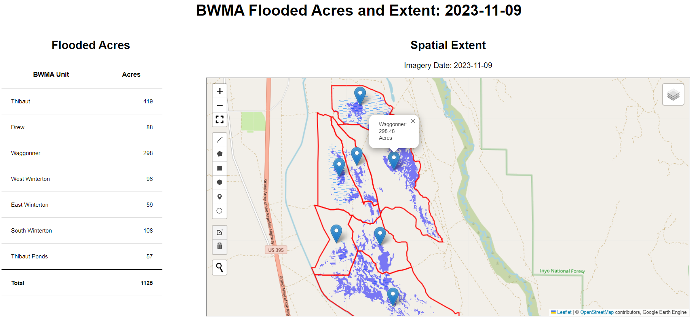
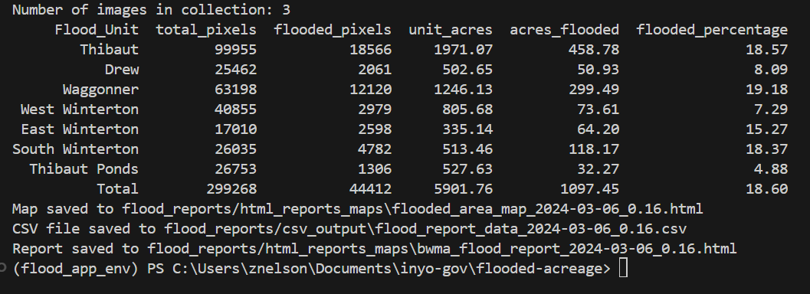

# Flooded Acreage Calculator

This project uses Sentinel-2 satellite data to threshold band 8 NIR into water and non-water pixels. It then calculates the flooded acreage within predefined units and generates reports with spatial and tabular data.

Currently the requirement to quantify flooded acreage in Blackrock Waterfowl Management Area has been implemented by field workers physically walking the wetted extent with a handheld GPS which can take up to 8 person days in the field every time it is needed. The current requirements of the project mandate this be done around the November 1, and March 1 time periods. The purpose of this application is two-fold: 1) provide mandated flooded acreage estimates instantaneously for the Nov 1 and Mar 1 periods, rather than multiple days of fied work, and 2) obtain acreage estimates throughout the year, every five days or whenever cloud-free Sentinel scenes are available. 

Sentinel 2 provides 10m resolution in Band 8 near-infrared, whereas Landsat resolution is 30m. The improved resolution of Sentinel over Landsat and improvements in availability of this imagery from earth engine's archive drove the development of this work. There are thousands of papers, and dozens of water indices used to quantify open water, yet they all use some combination of near infrared, short-wave infrared, or ratios of these. Here a simple thresholding of NIR is where I've started and it yields good results with a few validation points that will be obtained for the official Nov 1 and Mar 1 time periods to help calibrate the threshold for reporting purposes.

## Example Report

Here is an example of the report generated by the project:



## Table of Contents

- [Introduction](#introduction)
- [Setup and Installation](#setup-and-installation)
- [Usage](#usage)
- [Example Analysis](#example-analysis)
- [Technical Notes](#technical-notes)
- [License](#license)

## Introduction

This project is designed to compute the flooded acreage within specified units using Sentinel-2 Surface Reflectance imagery. The analysis involves:
- Filtering imagery based on cloud cover and dates.
- Applying a threshold to the NIR band to identify flooded areas.
- Calculating the area of flooded pixels within predefined units.
- Generating visual and tabular reports.

## Setup and Installation

### Prerequisites

- Python 3.x
- Google Earth Engine API
- Geopandas
- Geemap
- Pandas
- Folium

### Installation

1. Clone the repository:

   ```sh
   git clone https://github.com/inyo-gov/flooded-acreage-calculator.git
   cd flooded-acreage-calculator
   ```

2. Create and activate a virtual environment:

   ```sh
   python -m venv venv
   source venv/bin/activate  # On Windows use `venv\Scripts\activate`
   ```

3. Install the required libraries:

   ```sh
   pip install -r requirements.txt
   ```

4. Authenticate with Google Earth Engine:

   ```sh
   earthengine authenticate
   ```

## Usage

1. Open the Jupyter notebook `flooded_acreage_calculator.ipynb`.
2. Set the parameters for the analysis, including surface reflectance threshold, start date, and bounding box coordinates.
3. Run the notebook to perform the analysis and generate reports.

### Parameters

- **Surface Reflectance Threshold**: A value to threshold the NIR band for water detection.
- **Start Date**: The starting date for filtering Sentinel-2 imagery.
- **End Date**: Computed as start date + 15 days.
- **Bounding Box Coordinates**: Define the area of interest for the analysis.

### Example

```python
# Parameters
threshold = .16
start_date = '2024-06-06'

# Compute the end date
end_date = (datetime.strptime(start_date, '%Y-%m-%d') + timedelta(days=15)).strftime('%Y-%m-%d')

# Define the bounding box coordinates
bbox = [[-118.23240736400778, 36.84651455123723],
        [-118.17232588207419, 36.84651455123723],
        [-118.17232588207419, 36.924364295139625],
        [-118.23240736400778, 36.924364295139625]]
```

## Example Analysis

### Step 1: Import Libraries

```python
import ee
import geopandas as gpd
import geemap
import pandas as pd
import folium
import geemap.foliumap as geemap
from datetime import datetime, timedelta
import os
```

### Step 2: Authenticate and Initialize Earth Engine

```sh
# Run this in terminal to authenticate with gcloud
earthengine authenticate
```

```python
# Initialize Earth Engine
ee.Initialize()
```

### Step 3: Filter and Process Imagery

```python
# Filter sentinel 2 surface reflectance imagery
sentinel_collection = ee.ImageCollection('COPERNICUS/S2_SR_HARMONIZED') \
    .filterBounds(bounding_box_geometry) \
    .filterDate(start_date, end_date) \
    .filter(ee.Filter.lt('CLOUDY_PIXEL_PERCENTAGE', 30)) \
    .select(['B8', 'SCL'])  # Select NIR band (B8) and Scene Classification Layer (SCL) for masking clouds
```

### Step 4: Generate Reports

#### HTML Map

```python
# Create and save HTML map
Map.save(map_filename)
```

#### HTML Report

```python
# Create HTML report
html_report = f"""
<html>
<head>
    <title>BWMA Flooded Extent: {image_date_str}</title>
    <style>
        body {{
            font-family: Arial, sans-serif;
        }}
        .container {{
            display: flex;
            justify-content: space-between;
        }}
        .left {{
            width: 25%;
        }}
        .right {{
            width: 75%;
            text-align: center;
        }}
        h1, h2 {{
            text-align: center;
        }}
        .notes {{
            margin-top: 20px;
            padding: 10px;
            border-top: 1px solid #000;
        }}
        table {{
            width: 90%;
            font-size: 50px;
            border-collapse: collapse;
        }}
        th, td {{
            padding: 20px;
            text-align: left;
            border-bottom: 1px solid #ddd;
        }}
        th {{
            text-align: right;//from center
            font-size: 30px;
        }}
        td:nth-child(2) {{
            text-align: right;
        }}
        tr:last-child {{
            font-weight: bold;
            font-size: 80px;
        }}
        tr:last-child td {{
            border-top: 3px solid #000;
        }}
    </style>
</head>
<body>
    <h1>BWMA Flooded Acres and Extent: {image_date_str}</h1>
    <div class="container">
        <div class="left">
            <h2>Flooded Acres</h2>
            {html_table_simple}
        </div>
        <div class="right">
            <h2>Spatial Extent</h2>
            <p>Imagery Date: {image_date_str}</p>
            <iframe src="flooded_area_map_{image_date_str}_{threshold}.html" width="90%" height="500"></iframe>
        </div>
    </div>
    <div class="notes">
        <h3>Technical Notes</h3>
        <p>Flooded acres were calculated from Sentinel-2 Surface Reflectance imagery using the Earth Engine Python API in a Jupyter notebook.  Sentinel-2 (S2) is a wide-swath, high-resolution, multispectral imaging mission with a global 5-day revisit frequency.</p>
        <p>The S2 Multispectral Instrument (MSI) samples 13 spectral bands: Visible and NIR at 10 meters, red edge and SWIR at 20 meters, and atmospheric bands at 60 meters spatial resolution. The Near Infrared (NIR) band was used to identify flooded areas by applying a threshold to isolate water.</p>
        <p>The results are validated during routine field checks throughout the seasonal flooding cycle September through April.</p>
    </div>
</body>
</html>
"""
```

# Save the report to an HTML file
with open(report_filename, "w") as file:
    file.write(html_report)

### Running the CLI Python Script

You can also generate the flood report directly from the command line using the provided Python script.

1. Ensure your virtual environment is activated:
    ```sh
    source flood_app_env/bin/activate  # On Windows use `flood_app_env\Scripts\activate`
    ```

2. Run the script with the desired start date and threshold value:
    ```sh
    python flood_report.py <start_date> <threshold>
    ```

For example:
```sh
python flood_report.py 2024-03-01 0.16
```

This will output the number of images in the collection, a table of the flooded acreage per unit, and save the map, CSV file, and HTML report in the respective directories.

## Example Output

Here's an example of what you might see when you run the script:



## Technical Notes

- **Sentinel-2 Surface Reflectance Imagery**: This project uses Sentinel-2 SR imagery for its high resolution and frequent revisit time.
- **Google Earth Engine API**: The analysis is performed using the Earth Engine Python API for processing large geospatial datasets.
- **Geospatial Analysis**: Flooded areas are identified using the NIR band threshold and cloud-free composites.
- **Reports**: HTML reports are generated to visualize and summarize the flooded extents.

## License

This project is licensed under the MIT License. See the LICENSE file for details.

