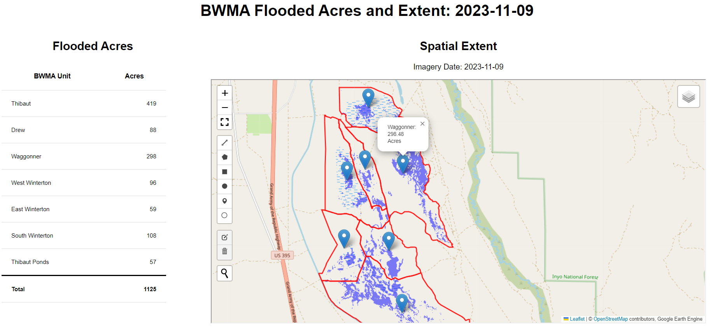
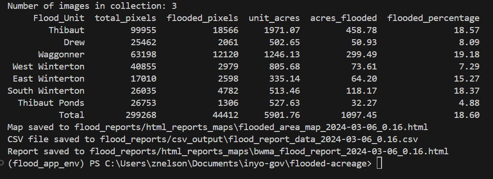

# Flooded Acreage Monitoring Dashboard

This project provides automated monitoring of flooded acreage in the Blackrock Waterfowl Management Area using **Sentinel-2 optical** imagery. The system generates individual flood reports and a dashboard with monthly time series visualization. **Sentinel-2 is the operational method** for monthly acreage and the public site; results have been reasonable for open water and many managed units. **Sentinel-1 SAR** scripts exist in the repo but are **not yet incorporated** into the dashboard workflow—planned for areas where **emergent vegetation** (e.g. cattails) masks the water signal in optical data.

Currently the requirement to quantify flooded acreage has been implemented by field workers physically walking the wetted extent with a handheld GPS, which can take up to 8 person days in the field every time it is needed. The current requirements mandate this be done around November 1 and March 1 time periods. This application provides: 1) instantaneous flooded acreage estimates for the Nov 1 and Mar 1 periods, rather than multiple days of field work, and 2) acreage estimates throughout the year, every five days or whenever cloud-free Sentinel scenes are available. 

Sentinel 2 provides 10m resolution in Band 8 near-infrared, whereas Landsat resolution is 30m. The improved resolution of Sentinel over Landsat and improvements in availability of this imagery from earth engine's archive drove the development of this work. There are thousands of papers, and dozens of water indices used to quantify open water, yet they all use some combination of near infrared, short-wave infrared, or ratios of these. Here a simple thresholding of NIR is where I've started and it yields good results with a few validation points that will be obtained for the official Nov 1 and Mar 1 time periods to help calibrate the threshold for reporting purposes.

## Dashboard

The project includes a comprehensive dashboard that displays:

- **Time Series Plot**: Monthly flooded acreage trends by unit
- **Interactive Table**: Links to all historical reports organized by fiscal year
- **Current Report Display**: Embedded iframe showing the most recent flood report

Access the dashboard at: `docs/index.html`

## Individual Reports

Here is an example of an individual flood report generated by the project:



## Table of Contents

- [Introduction](#introduction)
- [Setup and Installation](#setup-and-installation)
- [Usage](#usage)
- [Example Analysis](#example-analysis)
- [Technical Notes](#technical-notes)
- [License](#license)

## Introduction

This project computes flooded acreage within BWMA units from satellite data and publishes results through the Quarto dashboard.

**In production: Sentinel-2 (optical)**

- Monthly reports and the dashboard use `flood_report.py` only.
- Cloud-masked **median composite** over a 15-day window from the 1st of the month; NIR threshold for open water.
- Works well for **open water** and many flooded units; field validation supports threshold calibration.

**Upcoming: Sentinel-1 (SAR) and fusion**

- Scripts `flood_report_s1.py`, `flood_report_fusion.py`, and `sar_utils.py` are **experimental**—built and tested, but **not** part of the official monthly workflow or GitHub Pages dashboard yet.
- **Why add SAR:** Where **emergent vegetation overtops or obscures** the water surface, optical NIR can miss wet acreage. C-band SAR change detection (wet vs dry baseline) is intended to detect flooding **under** that vegetation.
- **Fusion** (union / intersection / confidence classes) would combine S2 open-water strength with S1 under-canopy sensitivity once SAR is production-ready.

The analysis calculates flooded area within predefined units and generates HTML reports and CSV exports.

## Setup and Installation

### Prerequisites

- Python 3.x
- Google Earth Engine API
- Geopandas
- Geemap
- Pandas
- Folium

### Installation

1. Clone the repository:

   ```sh
   git clone https://github.com/inyo-gov/flooded-acreage.git
   cd flooded-acreage
   ```

2. Create and activate a virtual environment:

   ```sh
   python -m venv venv
   source venv/bin/activate  # On Windows use `venv\Scripts\activate`
   ```

3. Install the required libraries:

   ```sh
   pip install -r requirements.txt
   ```

4. Authenticate with Google Earth Engine:

   ```sh
   earthengine authenticate
   ```

5. (Optional) Set Earth Engine Project ID:

   If you want to use a different Google Cloud project, set the environment variable:
   
   ```sh
   export EARTH_ENGINE_PROJECT_ID=your-project-id
   ```
   
   If not set, scripts will use the default project ID. Note: Project IDs are identifiers, not secrets, but you can keep them private by using this environment variable.

## Usage

### Generate Sentinel-2 Flood Report

Use the Python script to generate a flood report from Sentinel-2 optical imagery:

```sh
python flood_report.py <date> <threshold>
```

Example (monthly BWMA summary — use the **1st of the month** as the start date):

```sh
python flood_report.py '2026-06-01' 0.14
```

#### Monthly BWMA acreage workflow (for staff)

This repo’s **dashboard** (`index.qmd` → `docs/index.html`) is updated from Sentinel-2 reports generated by `flood_report.py`. The steps below are the intended monthly handoff once Earth Engine access is set up.

**When to run**

- Run **around the middle of the month** (e.g. the 12th–16th), not on the 1st.
- Use a **start date of the 1st** of that month (`YYYY-MM-01`). The script searches a **15-day window** (1st through the 16th).
- By mid-month there are usually **several** Sentinel-2 passes in the archive (often on the order of ~5–7 scenes). Waiting avoids a report based on only one early-month image.

**What the script does (composite, not a single scene)**

- Collects all Sentinel-2 surface reflectance images in the window (cloud cover &lt; 50%, clipped to the BWMA box).
- Masks clouds per scene (Sentinel **SCL**), then builds a **median composite** across those scenes.
- Flooded acreage uses **NIR (B8)** on that composite: pixels below the reflectance threshold count as water.
- This is **more robust** than thresholding one acquisition: a cloudy or odd pass is less likely to dominate the month.

**Report filenames vs. imagery**

- Console output includes `Number of images in collection:` — that is how many scenes fed the median.
- The HTML/CSV names use an **“Image date”** taken from the **first** image in the collection (often the 1st of the month). That label is for naming only; the acreage still reflects the **composite** over the full window.

**Threshold**

- Current monthly reports use **`0.14`** NIR reflectance (see validation notes elsewhere in this README). Re-calibrate from field GPS if wet/dry checks drift.

**After `flood_report.py`**

1. Confirm outputs under `flood_reports/reports/` and `flood_reports/csv_output/` (repo root; gitignored).
2. Render the site: `quarto render` (or `quarto render index.qmd`).
3. In `index.qmd`, set the **Most Recent Report** iframe `src` to the new `flood_reports/reports/bwma_flood_report_<date>_<threshold>.html` if you want that month featured (the monthly table links are built automatically from the report files at render time).
4. Commit and push **`docs/`** (and source changes) so GitHub Pages updates. Published report files live under **`docs/flood_reports/`** after render.

**Requirements:** Python deps, `earthengine authenticate`, and Earth Engine project access (`EARTH_ENGINE_PROJECT_ID` optional; see Setup).

### Sentinel-1 SAR and fusion (upcoming — not in dashboard yet)

The following scripts are **future work**. Staff should use **`flood_report.py`** for official monthly acreage until SAR is integrated and validated.

**Planned role:** SAR will help where **emergent vegetation** covers the water and the optical NIR signature is suppressed; open-water units can continue to rely primarily on Sentinel-2.

#### Sentinel-1 SAR flood report (experimental)

```sh
python flood_report_s1.py <start_date> <dry_start> <dry_end> [--dvv-thresh] [--vv-vh-ratio] [--orbit-pass]
```

Example:
```sh
python flood_report_s1.py '2024-10-22' '2024-08-01' '2024-08-31' --dvv-thresh -1.5
```

**Parameters:**
- `start_date`: Start date for wet/flood period (YYYY-MM-DD)
- `dry_start`: Start date for dry baseline period (YYYY-MM-DD)
- `dry_end`: End date for dry baseline period (YYYY-MM-DD)
- `--dvv-thresh`: dVV threshold in dB (default: -1.5). Lower values = more sensitive
- `--vv-vh-ratio`: Maximum VV-VH ratio in dB (default: 3)
- `--orbit-pass`: Filter by orbit direction: ASCENDING or DESCENDING (optional)

#### Fused S1+S2 report (experimental)

```sh
python flood_report_fusion.py <start_date> <s2_threshold> <dry_start> <dry_end> [--s1-thresh] [--fusion-mode] [--orbit-pass]
```

Example:
```sh
python flood_report_fusion.py '2024-10-22' 0.22 '2024-08-01' '2024-08-31' --fusion-mode union
```

**Fusion modes (when adopted):**
- `union` (default): Flood if either S1 or S2 detects it
- `intersection`: Flood only if both S1 and S2 detect it (conservative)
- `confidence`: Create confidence classes (1=S2-only, 2=S1-only, 3=both)

**Parameters:**
- `start_date`: Start date for wet/flood period (YYYY-MM-DD)
- `s2_threshold`: S2 NIR threshold (same as flood_report.py)
- `dry_start`: Start date for S1 dry baseline period (YYYY-MM-DD)
- `dry_end`: End date for S1 dry baseline period (YYYY-MM-DD)
- `--s1-thresh`: S1 dVV threshold in dB (default: -1.5)
- `--vv-vh-ratio`: S1 VV-VH ratio threshold in dB (default: 3)
- `--fusion-mode`: Fusion mode: union, intersection, or confidence (default: union)
- `--orbit-pass`: S1 orbit pass direction: ASCENDING or DESCENDING (optional)

### View the Dashboard

The dashboard is automatically generated and available at:
- Local: `docs/index.html`
- GitHub Pages: `https://inyo-gov.github.io/flooded-acreage/`

### Update the Dashboard

After generating new reports, rebuild the site:

```sh
quarto render
```

The **Monthly Reports** table reads CSVs from `flood_reports/csv_output/` and HTML links from `flood_reports/reports/` at render time. Quarto copies those into **`docs/flood_reports/`** (see `_quarto.yml` resources) so links work on GitHub Pages. Root **`/flood_reports/`** stays local and gitignored; what staff publish is under **`docs/`**.

See **Monthly BWMA acreage workflow** under Usage for timing (mid-month run, 1st-of-month start date, composite behavior).

**Branching:** For small fixes, fixing in place is usually enough. For larger changes (e.g. replacing the iframe with an interactive map, adding GIS layers), use a feature branch so you can revert or compare.

### Parameters (Sentinel-2 flood report)

- **Surface reflectance threshold**: NIR (B8) cutoff for water; applied to the **median composite**, not a single scene.
- **Start date**: First day of the search window (use **`YYYY-MM-01`** for monthly summaries).
- **End date**: Start date + 15 days (computed in the script).
- **Imagery**: All qualifying Sentinel-2 scenes in that window, cloud-masked, then **median** composite.
- **Bounding box**: Fixed BWMA extent in `flood_report.py`.

### Example

```python
# Parameters
threshold = .16
start_date = '2024-06-06'

# Compute the end date
end_date = (datetime.strptime(start_date, '%Y-%m-%d') + timedelta(days=15)).strftime('%Y-%m-%d')

# Define the bounding box coordinates
bbox = [[-118.23240736400778, 36.84651455123723],
        [-118.17232588207419, 36.84651455123723],
        [-118.17232588207419, 36.924364295139625],
        [-118.23240736400778, 36.924364295139625]]
```

## Example Analysis

### Step 1: Import Libraries

```python
import ee
import geopandas as gpd
import geemap
import pandas as pd
import folium
import geemap.foliumap as geemap
from datetime import datetime, timedelta
import os
```

### Step 2: Authenticate and Initialize Earth Engine

```sh
# Run this in terminal to authenticate with gcloud
earthengine authenticate
```

```python
# Initialize Earth Engine
ee.Initialize()
```

### Step 3: Filter and Process Imagery

```python
# Filter sentinel 2 surface reflectance imagery
sentinel_collection = ee.ImageCollection('COPERNICUS/S2_SR_HARMONIZED') \
    .filterBounds(bounding_box_geometry) \
    .filterDate(start_date, end_date) \
    .filter(ee.Filter.lt('CLOUDY_PIXEL_PERCENTAGE', 30)) \
    .select(['B8', 'SCL'])  # Select NIR band (B8) and Scene Classification Layer (SCL) for masking clouds
```

### Step 4: Generate Reports

#### HTML Map

```python
# Create and save HTML map
Map.save(map_filename)
```

#### HTML Report

```python
# Create HTML report
html_report = f"""
<html>
<head>
    <title>BWMA Flooded Extent: {image_date_str}</title>
    <style>
        body {{
            font-family: Arial, sans-serif;
        }}
        .container {{
            display: flex;
            justify-content: space-between;
        }}
        .left {{
            width: 25%;
        }}
        .right {{
            width: 75%;
            text-align: center;
        }}
        h1, h2 {{
            text-align: center;
        }}
        .notes {{
            margin-top: 20px;
            padding: 10px;
            border-top: 1px solid #000;
        }}
        table {{
            width: 90%;
            font-size: 50px;
            border-collapse: collapse;
        }}
        th, td {{
            padding: 20px;
            text-align: left;
            border-bottom: 1px solid #ddd;
        }}
        th {{
            text-align: right;//from center
            font-size: 30px;
        }}
        td:nth-child(2) {{
            text-align: right;
        }}
        tr:last-child {{
            font-weight: bold;
            font-size: 80px;
        }}
        tr:last-child td {{
            border-top: 3px solid #000;
        }}
    </style>
</head>
<body>
    <h1>BWMA Flooded Acres and Extent: {image_date_str}</h1>
    <div class="container">
        <div class="left">
            <h2>Flooded Acres</h2>
            {html_table_simple}
        </div>
        <div class="right">
            <h2>Spatial Extent</h2>
            <p>Imagery Date: {image_date_str}</p>
            <iframe src="flooded_area_map_{image_date_str}_{threshold}.html" width="90%" height="500"></iframe>
        </div>
    </div>
    <div class="notes">
        <h3>Technical Notes</h3>
        <p>Flooded acres were calculated from Sentinel-2 Surface Reflectance imagery using the Earth Engine Python API in a Jupyter notebook.  Sentinel-2 (S2) is a wide-swath, high-resolution, multispectral imaging mission with a global 5-day revisit frequency.</p>
        <p>The S2 Multispectral Instrument (MSI) samples 13 spectral bands: Visible and NIR at 10 meters, red edge and SWIR at 20 meters, and atmospheric bands at 60 meters spatial resolution. The Near Infrared (NIR) band was used to identify flooded areas by applying a threshold to isolate water.</p>
        <p>The results are validated during routine field checks throughout the seasonal flooding cycle September through April.</p>
    </div>
</body>
</html>
"""
```

# Save the report to an HTML file
with open(report_filename, "w") as file:
    file.write(html_report)

### Project Structure

```
flooded-acreage/
├── flood_report.py          # Sentinel-2 optical (production monthly workflow)
├── flood_report_s1.py       # Sentinel-1 SAR (experimental; not in dashboard yet)
├── flood_report_fusion.py  # S1+S2 fusion (experimental; not in dashboard yet)
├── sar_utils.py            # SAR helpers for upcoming S1 work
├── dem_utils.py            # DEM utilities (for future use)
├── index.qmd               # Quarto source for the dashboard
├── _quarto.yml            # Quarto configuration
├── docs/                  # Generated website files
│   ├── index.html        # Main dashboard
│   ├── reports/          # Individual flood reports
│   ├── csv_output/       # CSV data files
│   └── index_files/      # Plot images
├── requirements.txt       # Python dependencies
└── README.md            # This file
```

### Complete Workflow

1. **Generate new report**:
   ```sh
   python flood_report.py '2025-09-17' 0.15
   ```

2. **Update dashboard**:
   ```sh
   quarto render index.qmd
   ```

3. **View results**:
   - Open `docs/index.html` in your browser
   - Or push to GitHub for GitHub Pages hosting

## Example Output

Here's an example of what you might see when you run the script:



## Technical Notes

### Sentinel-2 (Optical) — production

- **Surface reflectance:** Sentinel-2 SR, 10 m NIR, ~5-day revisit; median composite over the monthly window (see staff workflow above).
- **Flood detection:** NIR thresholding identifies **open water** well; this is what the dashboard uses today.
- **Limitation:** Can **under-estimate** flooding where **emergent vegetation** (e.g. cattails) covers the surface and the water no longer looks like open water in NIR—that is the main motivation for future SAR work.

### Sentinel-1 (SAR) — upcoming

- **Not yet in the monthly dashboard.** Scripts exist for development and testing.
- **Intended use:** Detect wetness **under emergent vegetation** when optical NIR is masked; C-band SAR change detection (wet period vs dry baseline) responds to water beneath canopy structure.
- **Indicators:** dVV (VV backscatter change), VV/VH ratio; requires a **dry baseline** period (often summer).

### Fusion — upcoming

- When adopted, combine S2 (open water) with S1 (under-vegetation) via union, intersection, or confidence classes.
- **Goal:** Fuller extent where cattails or similar emergent veg overtop the water optical signature, without losing S2 strength on open units.

### General
- **Google Earth Engine API**: All analysis performed using the Earth Engine Python API for processing large geospatial datasets.
- **Dashboard Technology**: The dashboard is built with Quarto, providing interactive time series visualization and report management.
- **Data Management**: Historical data is automatically tracked and visualized in the dashboard.
- **Reports**: Individual HTML reports are generated for each analysis, with CSV data export capabilities.
- **Field Validation**: Results are validated during routine field checks throughout the seasonal flooding cycle (September through April). Field data collection in ArcGIS Online will inform future threshold calibration and relative elevation analysis needs.

## Model Validation

The flood mapping model is validated using field-collected GPS points from biologists during bird surveys.

### Field Data Collection

Biologists collect GPS points (yes/no flooded) using ArcGIS Online during regular bird surveys. See `docs/field_validation_protocol.md` for detailed collection guidelines.

### Running Validation Analysis

After exporting validation data from ArcGIS Online to GeoJSON or CSV:

```sh
python validate_flood_model.py <validation_data> <report_date> [--threshold]
```

Example:
```sh
python validate_flood_model.py data/validation/validation_points_2025-12-08.geojson 2025-12-08 --threshold 0.18
```

This generates:
- **Validation Report (HTML)**: Accuracy metrics, confusion matrix, spatial analysis
- **Validation Points CSV**: Point-by-point comparison of observed vs predicted
- **Validation Map (HTML)**: Interactive map showing correct/incorrect predictions

### Validation Metrics

The validation analysis calculates:
- Overall Accuracy
- Precision (of predicted flooded, how many are actually flooded?)
- Recall/Sensitivity (of actually flooded, how many did we detect?)
- Specificity (of actually dry, how many did we correctly identify?)
- F1 Score
- Accuracy by unit

Results help calibrate the NIR threshold and improve model performance over time.

## License

This project is licensed under the MIT License. See the LICENSE file for details.

